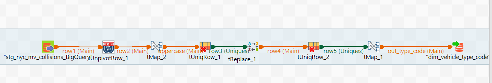

# NewYork_Collisions_DataAnalysis
This repository contains a data analysis project focused on exploring and understanding collisions that occur in New York City. The dataset used for this project is the NYPD Motor Vehicle Collisions data, which provides information on all collisions that have occurred in the city since 2012.

The project uses various data analysis and visualization techniques to uncover patterns and trends in the data, such as the most common causes of collisions, the neighborhoods with the highest number of collisions, and the times and days when collisions are most likely to occur.

images/: This directory contains any images or charts generated by the analysis.

# Alteryx Workflow:

# --DataProfiling

# Talend Workflow:

# --DataProfiling

# --DataPreparation

## Tableau Dashboards ##
# --Total Collision by Year

# --No of people injuerd or killed by Role

# --Collision counts by Boroughs

# --Bicylist Accident by year & month

